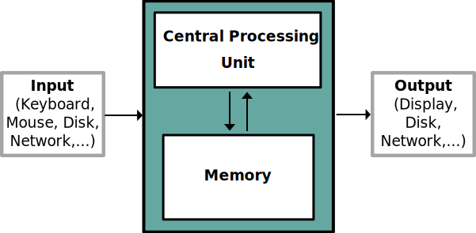
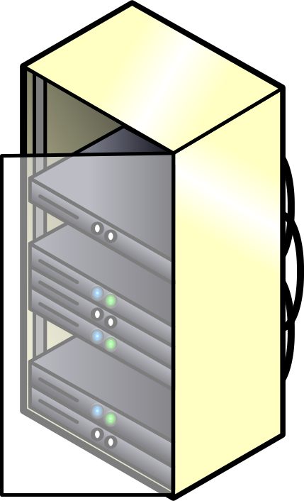
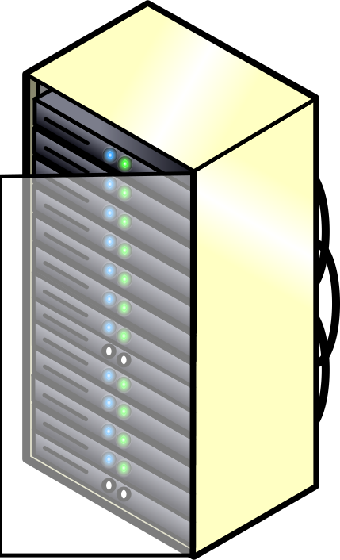

::: questions
 - Why would I be interested in High Performance Computing (HPC)?
 - What can I expect to learn from this course?
:::

::: objectives
 - Be able to describe what an HPC system is
 - Identify how an HPC system could benefit you.
:::

## HPC research examples

Frequently, research problems that use computing can outgrow the capabilities
of the desktop or laptop computer where they started:

* A statistics student wants to cross-validate a model. This involves running
  the model 1000 times &mdash; but each run takes an hour. Running the model on
  a laptop will take over a month! In this research problem, final results are
  calculated after all 1000 models have run, but typically only one model is
  run at a time (in **serial**) on the laptop. Since each of the 1000 runs is
  independent of all others, and given enough computers, it's theoretically
  possible to run them all at once (in **parallel**).
* A genomics researcher has been using small datasets of sequence data, but
  soon will be receiving a new type of sequencing data that is 10 times as
  large. It's already challenging to open the datasets on a computer &mdash;
  analyzing these larger datasets will probably crash it. In this research
  problem, the calculations required might be impossible to parallelize, but a
  computer with **more memory** would be required to analyze the much larger
  future data set.
* An engineer is using a fluid dynamics package that has an option to run in
  parallel. So far, this option was not utilized on a desktop. In going from 2D
  to 3D simulations, the simulation time has more than tripled. It might be
  useful to take advantage of that option or feature. In this research problem,
  the calculations in each region of the simulation are largely independent of
  calculations in other regions of the simulation. It's possible to run each
  region's calculations simultaneously (in **parallel**), communicate selected
  results to adjacent regions as needed, and repeat the calculations to
  converge on a final set of results. In moving from a 2D to a 3D model, **both
  the amount of data and the amount of calculations increases greatly**, and
  it's theoretically possible to distribute the calculations across multiple
  computers communicating over a shared network.

In all these cases, access to more (and larger) computers is needed. Those
computers should be usable at the same time, **solving many researchers'
problems in parallel**.

::: discussion

## Break the Ice
Talk to your neighbour, office mate or [rubber duck](https://rubberduckdebugging.com/) about your research.

 * How does computing help you do your research?
 * How could more computing help you do more or better research?
:::

## Jargon Busting

### Your Personal Computer

We are probably all familiar with a laptop or a desktop computer (some call it a PC for Personal Computer). These computers are aimed at individual users and people coding or analysing. Typically each one of us, in the classroom, has our own laptop or a university computer in front of us and we can work independantly of one another. It is good for performaing local and personal tasks but it has limited resources.

{alt="A standard laptop"}

### Shared Computing Resources

What happens when we want to share resources, like printers or files? In the late 1950s the US military built a network of computers that used modems and normal telephone lines connect to one another. Things have progressed quite a bit since then. Today our computers can talk to one another in several ways. At most universities you might notice that the desktop computers have a wire (called an Ethernet cable) that connects it to the university's network. Laptops and other devices such as phones and tablets can also connect to networks using WiFi which is a wireless technology using radio waves. However what happens if we want a computer to perform a task which requires much more hardware than what our desktop or laptop can provide us with?

### A Larger Computer

One alternative is to build up a computer with very powerful components. The main components of a computer would be its input devices, processor, memory and output devices such a hard drive. Each of these components can be upgraded to more powerful versions. This is somewhat analogous to buying a car. You might decide to buy a car that can take more people so instead of a two seater sports car you would look at a bigger car that can take four, six or eight people. However, a car that can carry eight people will also need a bigger engine because the engine of the smaller car won't be strong enough to move eight people. Computers can also be specced to accomplish certain tasks, so for some tasks you might need very fast processing power but not so much memory, other jobs might need lots of memory while others might need really big hard drives to store data too.

A big disadvantage of a computer with bigger and better hardware is that its application becomes limited or in some cases using it for other tasks might mean that its use becomes very expensive or it might just not be as suitable anymore. Using the car analogy; you wouldn't use a bus to take your two children to school on a regular basis. So you might find that quite often a very expensive computer was purchased for a specific project and after completion of the project the computer becomes an extremely expensive ornament standing in a corner gather dust. What is the alternative?

### Cloud Systems

How about buying a car suitable to take your children to school on a regular basis and then **renting** a bus for the odd occasion that you have to take 30 kids to the museum? We now have cloud computing available to be able to fulfil a similar role when the need arises to use a bigger or faster computer. But first, what exactly is cloud computing? Actually it is nothing other than computer networks, as described in the section about **Shared Computing Resources**, that belong to external organisations and are connected to the Internet so that, in turn, we can also connect to them. And for the privilege of being able to access those computers we will pay a fee - like renting a car. We can specify exactly what we need in terms of the amount of memory, the speed of the processors, the amount of RAM and so forth. So this might be a good solution but, as always, there are loads of ifs and buts ... so what if we, as an organisation, make so much use of these computers that we want our very own? Cloud computers will also have certain limitations so that we can't always get the specifications we want so we might, even if we can't afford our own, want an alternative to cloud computing.

The Cloud is a generic term commonly used to refer to computing resources that are a) provisioned to users on demand or as needed and b) represent real or virtual resources that may be located anywhere on Earth. For example, a large company with computing resources in Brazil, Zimbabwe and Japan may manage those resources as its own internal cloud and that same company may also utilize commercial cloud resources provided by Amazon or Google. Cloud resources may refer to machines performing relatively simple tasks such as serving websites, providing shared storage, providing web services (such as e-mail or social media platforms), as well as more traditional compute intensive tasks such as running a simulation.

### A Cluster or Supercomputer

The term HPC system, on the other hand, describes a stand-alone resource for computationally intensive workloads. They are typically comprised of a multitude of integrated processing and storage elements, designed to handle high volumes of data and/or large numbers of floating-point operations (FLOPS) with the highest possible performance. For example, all of the machines on the Top-500 list are HPC systems. To support these constraints, an HPC resource must exist in a specific, fixed location: networking cables can only stretch so far, and electrical and optical signals can travel only so fast.

The word “cluster” is often used for small to moderate scale HPC resources less impressive than the Top-500. Clusters are often maintained in computing centers that support several such systems, all sharing common networking and storage to support common compute intensive tasks.

Let's dissect what resources programs running on a laptop require:

* the keyboard and/or touchpad is used to tell the computer what to do
  (**Input**)
* the internal computing resources **Central Processing Unit** and **Memory**
  perform calculation
* the display depicts progress and results (**Output**)

Schematically, this can be reduced to the following:

{
   alt="Schematic of how a computer works"}

## When Tasks Take Too Long

When the task to solve becomes heavy on computations, the operations are
typically out-sourced from the local laptop or desktop to elsewhere. Take for
example the task to find the directions for your next vacation. The
capabilities of your laptop are typically not enough to calculate that route
spontaneously: [finding the shortest path](https://en.wikipedia.org/wiki/Dijkstra's_algorithm) through a network runs on
the order of (*v* log *v*) time, where *v* (vertices) represents the number of
intersections in your map. Instead of doing this yourself, you use a website,
which in turn runs on a server, that is almost definitely not in the same room
as you are.

{alt="A rack half full with servers}

Note here, that a server is mostly a noisy computer mounted into a rack cabinet
which in turn resides in a data center. The Internet made it possible that
these data centers do not require to be nearby your laptop. What people call
**The Cloud** is mostly a web-service where you can rent such servers by
providing your credit card details and requesting remote resources that satisfy
your requirements. This is often handled through an online, browser-based
interface listing the various machines available and their capacities in terms
of processing power, memory, and storage.

The server itself has no direct display or input methods attached to it. But
most importantly, it has much more storage, memory and compute capacity than
your laptop will ever have. In any case, you need a local device (laptop,
workstation, mobile phone or tablet) to interact with this remote machine,
which people typically call 'a server'.

## When One Server Is Not Enough

If the computational task or analysis to complete is daunting for a single
server, larger agglomerations of servers are used. These go by the name of
"clusters" or "super computers".

{"A rack with servers"}

The methodology of providing the input data, configuring the program options,
and retrieving the results is quite different to using a plain laptop.
Moreover, using a graphical interface is often discarded in favor of using the
command line. This imposes a double paradigm shift for prospective users asked
to

1. work with the command line interface (CLI), rather than a graphical user
   interface (GUI)
1. work with a distributed set of computers (called nodes) rather than the
   machine attached to their keyboard & mouse

::: challenge

## I've Never Used a Server, Have I?
Take a minute and think about which of your daily interactions with a
computer may require a remote server or even cluster to provide you with
results.

::: solution

## Some Ideas

* Checking email: your computer (possibly in your pocket) contacts a remote
  machine, authenticates, and downloads a list of new messages; it also
  uploads changes to message status, such as whether you read, marked as
  junk, or deleted the message. Since yours is not the only account, the
  mail server is probably one of many in a data center.
* Searching for a phrase online involves comparing your search term against
  a massive database of all known sites, looking for matches. This "query"
  operation can be straightforward, but building that database is a
  [monumental task](https://en.wikipedia.org/wiki/MapReduce)! Servers are
  involved at every step.
* Searching for directions on a mapping website involves connecting your
  (A) starting and (B) end points by [traversing a graph](
  https://en.wikipedia.org/wiki/Dijkstra%27s_algorithm) in search of
  the "shortest" path by distance, time, expense, or another metric.
  Converting a map into the right form is relatively simple, but
  calculating all the possible routes between A and B is expensive.

Checking email could be serial: your machine connects to one server and
exchanges data. Searching by querying the database for your search term (or
endpoints) could also be serial, in that one machine receives your query
and returns the result. However, assembling and storing the full database
is far beyond the capability of any one machine. Therefore, these functions
are served in parallel by a large, ["hyperscale"](https://en.wikipedia.org/wiki/Hyperscale_computing) 
collection of servers working together.
:::
:::

::: keypoints
 - "High Performance Computing (HPC) typically involves connecting to very large
  computing systems elsewhere in the world."
 - "These other systems can be used to do work that would either be impossible
  or much slower on smaller systems."
 - "The standard method of interacting with such systems is via a command line
  interface called Bash."
:::
